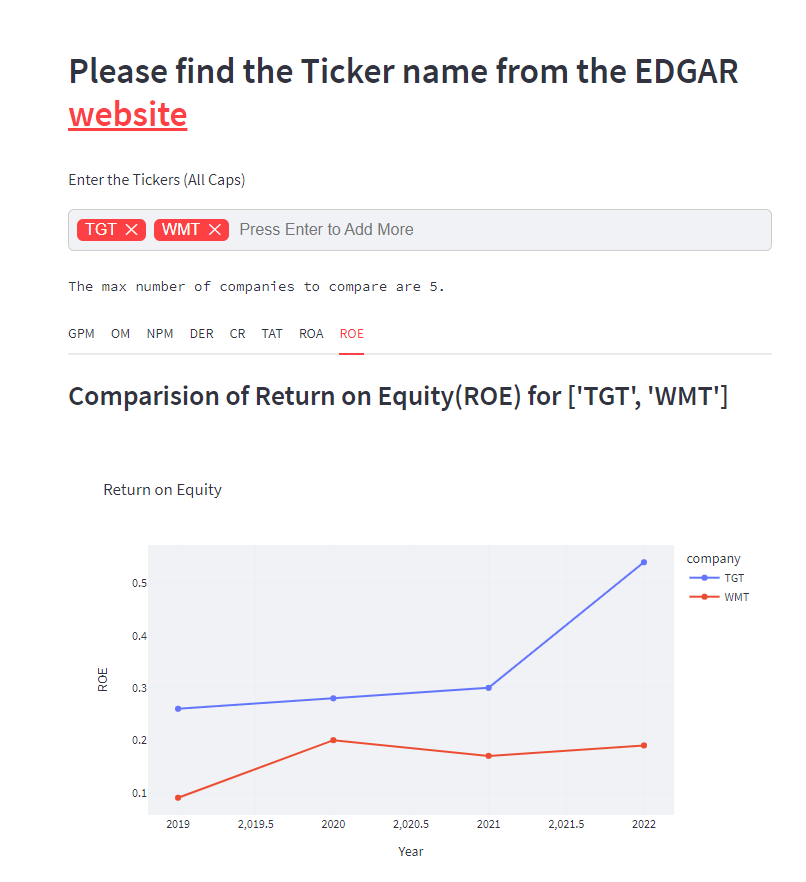

### About

This app simply shows the different financial ratio of the publicly traded companies. 

You can access the app via: [**link**](https://sharmajee499-financial-statements-streamlit-7tudgd.streamlitapp.com/)

The financial ratios are listed below:

- Gross Profit Margin (GPM)
- Operating Margin (OM)
- Net Profit Margin (NPM)
- Debt-Equity Ratio (DER)
- Current Ratio (CR)
- Total Asset Turnover (TAT)
- Return on Asset (ROA)
- Return on Equity (ROE)

### Data Acquisition

The data is acquired via [**Yahoo Finanace**](https://finance.yahoo.com/) with the help of the two python API's i.e. [finpie](https://pypi.org/project/finpie/) & [yfinance](https://pypi.org/project/yfinance/). We access the balance sheet and income statement through these APIs.

### Financial Ratio Calculation

With the accquired data, we calculated the financial ratio through the respective formula. You can find the financial ratio explanation and formula on the 'Explanation' section of the app at the bottom.

### Implication

There are already thousands of website conveying the same information in more fancy and optimized way. The purpose of making this one is to show how easy and handy it is to use the [Streamlit](https://streamlit.io/). Data Scientist and Analyst doesn't have time to create a UI app using HTML, CSS and Javascript etc. from scratch. With tools like Streamlit, we can easily convey our result and data insights to the business stakeholder

### Requirements

Please, refer to the `requirements.txt` file. 
